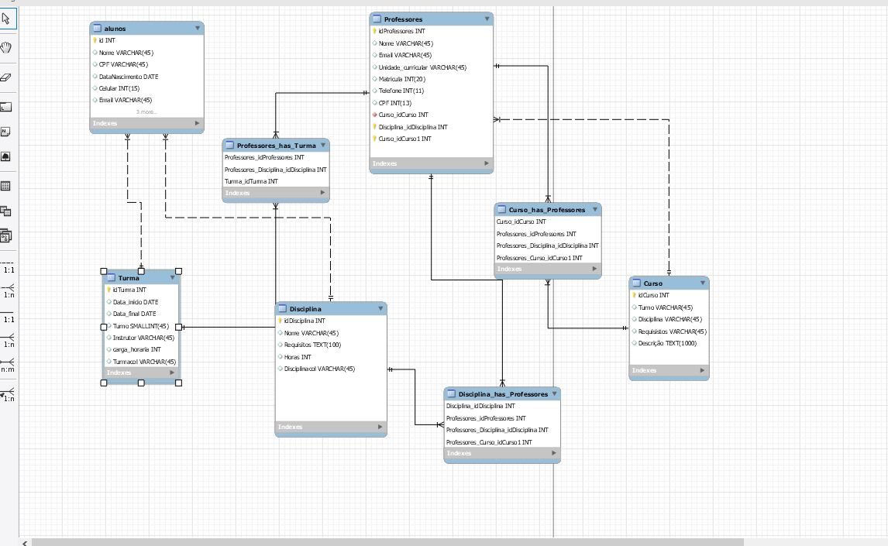

# Módulo 4 - Banco de dados (MySQL)
## Projeto individual 

> Desafio

A Resilia está pensando em lançar um novo sistema de acompanhamento e para isso precisa de ajuda para modelar um banco de dados que vai armazenar seus cursos, turmas e alunos. Com isso, recebemos a tarefa de realizar essa modelagem e responder algumas perguntas com nosso modelo.

> Perguntas
>* Existem outras entidades além dessas três?
>* Quais são os principais campos?
>* Como essas entidades são relacionadas?

> Respostas 
>* Sim, as entidades são criadas de acordo com as necessidades 
>* Disciplinas, alunos, professores, cursos e turmas.
>* Estão relacionados em ligação de muitos para muitos (N:N) e um para muitos (1:N) 

> Conhecimentos adquiridos
>* Criação de Banco de dados
>* Utilização da ferramenta MySQL
>* Comandos para criação de tabelas, atributos, etc.

> Ferramentas utilizadas 
>* MySQL Workbench
